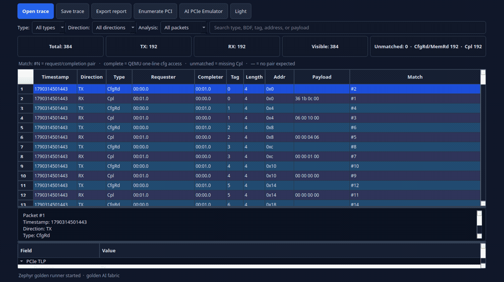
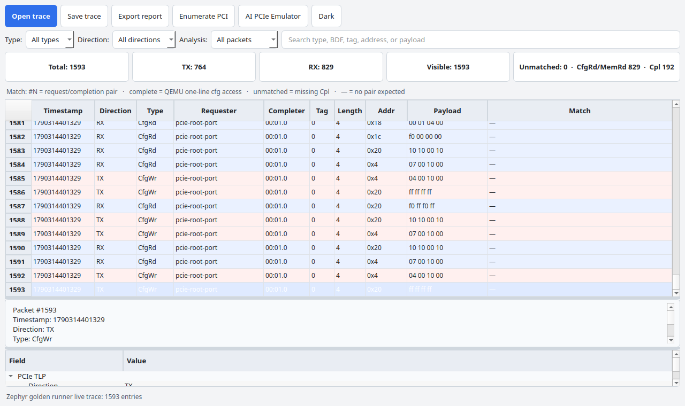
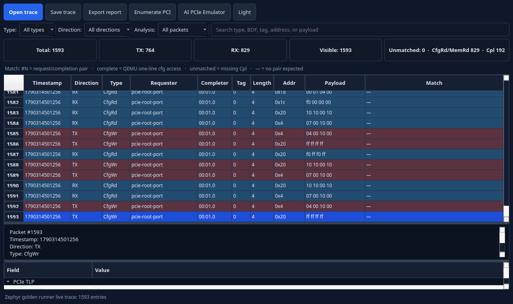

<p align="center">
  
</p>

<h1 align="center">pcieshark</h1>

<p align="center">
  Open PCIe trace, enumeration, and analysis toolkit
</p>

<p align="center">
  <a href="https://khademullah.github.io/pcieshark/">khademullah.github.io/pcieshark</a>
</p>

<p align="center">
  
</p>

<p align="center">
  <a href="docs/demos/terminal.md">Build and pci_cfg terminal</a>
  ·
  <a href="docs/demos/zephyr-gui.md">Zephyr topology + GUI</a>
  ·
  <a href="docs/demos/light-trace.md">Light theme of this 1500+ TLP capture</a>
</p>

pcieshark is a developer-facing toolkit for building, inspecting, and validating PCIe traffic. It combines a reusable C library (`libpcapcie`), example programs, a Qt GUI, and Zephyr or Linux QEMU topology flows so the same stack works on real hardware and emulated fabrics.

It is designed to be:

- open and inspectable
- backend-driven and portable
- useful on both real devices and emulated PCIe topologies
- buildable with a standard CMake workflow

## Why this project exists

PCIe bring-up usually needs a mix of raw trace inspection, config-space enumeration, protocol decode, and link-performance checks. pcieshark gives those workflows a practical foundation without a closed vendor stack:

- direct PCIe backend access
- high-level TLP create/parse/filter
- GUI review of live or captured traces
- optional Zephyr or Linux QEMU topology for enumeration experiments

## Core features

- PCIe TLP creation and parsing
- Configuration-space read/write
- TLP filtering and sniffing hooks
- Link and topology inspection
- Backends for PCI and dummy (FPGA and ARM DS are planned)
- Trace capture and export (pcap-style or CSV)
- Qt GUI for live or offline packet browsing
- Zephyr and Linux QEMU topology execution for enumeration-style work
- Built-in golden AI fabric shared by both guests

## Repository structure

- `src/` — core library and backend implementations
- `include/pcapcie/` — public library headers
- `include/pcie_topology.h` — topology model used by the emulator
- `examples/` — CLI tools for TLP, link, capture, and topology flows
- `gui/` — Qt desktop application
- `scripts/` — QEMU helpers for Zephyr and Linux guests
- `pcieshark/` — product notes for the CLI and GUI front-end
- `docs/assets/` — logo, GUI screenshots, and a sample analysis report

## Supported workflows

1. **Trace-only** — open a captured file, inspect TLPs, filter by direction, type, or identifier.
2. **Live trace** — run the Zephyr or Linux QEMU topology, collect config-space traffic, review packets in real time.
3. **PCI enumeration** — use a backend to inspect a target device and validate reported link information.
4. **Experimental topology** — run an emulated AI fabric, inspect enumeration, keep that path separate from the main TLP stream.

## Requirements

- Linux
- CMake 3.13+
- C/C++ toolchain
- Python 3 with PySide6 for the GUI (`pip install -r requirements.txt`)
- Zephyr SDK and a kernel image for the Zephyr topology flow, or a Linux disk/kernel image for the Linux QEMU flow

### Zephyr-backed emulation

```bash
source ~/zephyrproject/.venv/bin/activate
export ZEPHYR_BASE=~/zephyrproject/zephyr
export ZEPHYR_TOOLCHAIN_VARIANT=zephyr
export ZEPHYR_SDK_INSTALL_DIR=$HOME/zephyr-sdk-1.0.1
```

Point `KERNEL_PATH` at a built Zephyr image if it is not already available as `build/zephyr/zephyr.elf`.

## Quick start

### 1. Clone and configure

```bash
git clone git@github.com:khademullah/pcieshark.git
cd pcieshark
cmake -S . -B build
```

### 2. Build

```bash
cmake --build build -j$(nproc)
```

### 3. Launch the GUI

The desktop app is Python and still uses Qt (PySide6). From the repository root:

```bash
python3 -m venv .venv
.venv/bin/pip install -r requirements.txt
./run_pcieshark.sh
```


## Build targets

```bash
./build/pcieshark
./build/enumerate_topology
./build/pci_link_check
./build/pci_link_matrix
./build/pci_link_status
./build/simple_tlp_test
./build/tlp_capture
./run_pcieshark.sh
```

## Trace workflow

- **Open** a captured CSV, QEMU `pci_cfg_*` log, or library pcap (`.pcie`) in the GUI.
- **Save** the active table as CSV (default) so it reloads with the same columns.
- **Inspect a row** for header fields, BDF/RID decode, payload hex, and PCI config meaning.
- **Match** CfgRd/MemRd requests to Cpl completions (double-click the Match column to jump).
- Filter by type, direction, unmatched/matched, or full-text search across every column.
- **Export report** writes an HTML analysis of the open trace: type counts, match summary, devices seen at config offset `0x00`, and unmatched requests. A sample from the golden fabric is in [docs/assets/pcieshark_report.html](docs/assets/pcieshark_report.html).

The stats bar reports TX/RX, visible rows, unmatched requests, and CfgRd vs Cpl counts.

CLI mode uses the same product name:

```bash
./build/pcieshark /tmp/pcie_trace.csv
./build/pcieshark /tmp/pcie_trace.csv --summary
```

## AI PCIe emulator

The emulator models a data-center style PCIe fabric for accelerator-heavy systems, not just a dummy traffic generator. The same view supports enumeration, trace capture, and performance measurement.

Typical fabric:

- CPU complex as the root domain
- four root ports, one fabric branch each
- upstream switch hierarchy per branch
- NVMe endpoints for storage
- GPU-like accelerator endpoints
- SmartNIC / network endpoints

### Golden AI topology

The default preset is a built-in deterministic fabric:

- root bus: `PCIe Bus 00`
- root ports: `rp1` … `rp4`
- switches with downstream ports `dp0` / `dp1`
- endpoints: GPU 1–4, NVMe 1–2, SmartNIC 1–2, plus per-branch data-path devices

This layout is intentionally fixed so benchmarks and traces stay comparable.

### Enumeration flow

1. Launch the Zephyr or Linux QEMU topology.
2. Boot the guest with the PCIe fabric model.
3. Enumerate the topology from the guest (`pcie ls` on Zephyr, `lspci` on Linux).
4. Collect bus/device information into a structured log.
5. Parse that list into a PCIe map for the GUI and analysis tools.

The guest PCI-list path stays isolated from the main TLP stream so enumeration logs do not overwrite performance or capture runs.

### Performance

QEMU NVMe stand-ins are not accelerators, so AI tokens/sec is not measurable on this fabric. The emulator **Measure** button times a real config-space walk of every device in the deployed topology (no invented latency or token targets) and reports **cfg/s**.

### Runners

The same built-in golden fabric is attached as QEMU `-device` arguments for either guest. That works on a VM: QEMU emulates the switches, NVMe stand-ins, and NICs; the guest only has to enumerate them.

```bash
./scripts/run_zephyr_ai_topology.sh
```

The Zephyr script checks the venv, source tree, SDK, QEMU binary, and kernel image, then starts the emulated topology. Override paths with `ZEPHYR_BASE`, `ZEPHYR_SDK_INSTALL_DIR`, and `KERNEL_PATH` as needed.

```bash
./scripts/run_linux_ai_topology.sh
DISK_IMAGE=/path/to/linux.qcow2 ./scripts/run_linux_ai_topology.sh
```

The Linux runner is `qemu-system-x86_64` on q35 with `-vga none` and the same golden `-device` fabric. It uses `linux-guest.qcow2` in the repo if present. In the GUI, pick **Linux QEMU runner** in the AI emulator to use this path.

## PCI backend notes

The built-in PCI backend reads and writes Linux sysfs config space:

```text
/sys/bus/pci/devices/<domain:bus:device.function>/config
```

This typically needs root privileges or a permission setup that allows sysfs access.

```bash
lspci -Dnn | grep -Ei 'Express|PCIe|Bridge'
```

Use a real PCIe endpoint with Express capability data. A host bridge or virtualized system device is usually the wrong target.

## Supported backends

These are the backends used and tested in this release:

- `dummy` — deterministic software-only mock
- `pci` — Linux sysfs PCI config space

### Planned backends

The following backends exist in the tree but are **not tested** and are not part of the current product. They may be enabled after hardware bring-up:

- `fpga` — FPGA BAR / register path (`src/backend_fpga.c`, see `FPGA_CONFIG.md`)
- `armds` — ARM Development Studio bridge (`src/backend_armds.c`, see `ARM_DS_BRIDGE_README.md`)

Do not select these from the GUI. They remain in the tree for later hardware bring-up.

## Link capability checks

The library can inspect PCIe capability blocks and report max/negotiated link speed, width, and generation. Use `./build/pci_link_check`, `./build/pci_link_status`, or `./build/pci_link_matrix` against a real endpoint.

## Trace capture and export

```bash
./build/tlp_capture dummy /tmp/pcie_tlps.pcap
./build/tlp_capture dummy /tmp/pcie_tlps.csv csv
```

## GUI overview

The Qt application focuses on readable packet inspection:

- open / save traces
- packet table, match analysis, and row metadata
- HTML analysis report export
- live versus captured traffic
- optional topology enumeration logs, kept separate from the main TLP view

Light and dark views of a live QEMU config-space trace, including Match analysis (`complete` for one-line `pci_cfg` accesses):





Example analysis report from that session: [pcieshark_report.html](docs/assets/pcieshark_report.html).

## Release status

The core library, GUI, backends, examples, and QEMU topology tooling (Zephyr or Linux guests) form a stable baseline. Experimental AI topology and performance flows are supported as extensions, not the definition of the first release.

## Contributing

See [CONTRIBUTING.md](CONTRIBUTING.md). Useful areas include backends, parsing/filtering, visualization, topology validation, and examples.

## License

[MIT](LICENSE)
